# Document Verification System — Architecture & Design Document (Phase 1)

## 1. Scope Note

The **Document Verification System** is an enterprise-grade academic Java OOP project designed to validate documents against a configurable pipeline of verification rules and produce a comprehensive verification report.

### Supported Document Types:
1. **`IDCardDocument`**: Represents identity cards with specific fields including `idNumber` (matching pattern `ID-YYYY-NNNN`) and `expiryDate`.
2. **`CertificateDocument`**: Represents educational/professional certificates with `certificateNumber`, `issuingAuthority`, and `grade`.

### Configurable Verification Rules (Strategy Pattern):
1. **`RequiredFieldRule`**: Verifies that all mandatory fields for the document type are non-null and non-empty.
2. **`DateValidityRule`**: Checks that issue dates are chronologically plausible (not in the future, within acceptable historical limits).
3. **`FormatPatternRule`**: Verifies document and identification numbers against strict regex patterns.
4. **`ChecksumIntegrityRule`**: Validates tamper-detection digests (e.g. SHA-256) to detect post-issuance alteration.
5. **`DuplicateCheckRule`**: Checks if the document ID has already been recorded in the persistence store (`DocumentRepository`), detecting duplicates across sessions.
6. **`ExpiryRule`**: Validates whether expiring documents (e.g., ID cards) are still currently valid.

---

## 2. UML Class Diagram

```mermaid
classDiagram
    %% Interfaces
    class Verifiable {
        <<interface>>
        +isStructurallyValid() boolean
    }

    class VerificationRule {
        <<interface>>
        +verify(Document document) VerificationResult
        +getRuleName() String
    }

    class DocumentRepository {
        <<interface>>
        +save(Document document) void
        +findById(String documentId) Optional~Document~
        +existsById(String documentId) boolean
        +saveReport(VerificationReport report) void
    }

    %% Abstract Base Document
    class Document {
        <<abstract>>
        -documentId: String
        -ownerName: String
        -issueDate: LocalDate
        +getDocumentId() String
        +setDocumentId(String documentId) void
        +getOwnerName() String
        +setOwnerName(String ownerName) void
        +getIssueDate() LocalDate
        +setIssueDate(LocalDate issueDate) void
        +hasRequiredFields()* boolean
        +calculateChecksum() String
        +toString() String
        +equals(Object o) boolean
        +hashCode() int
    }

    %% Concrete Documents
    class IDCardDocument {
        -idNumber: String
        -expiryDate: LocalDate
        +getIdNumber() String
        +setIdNumber(String idNumber) void
        +getExpiryDate() LocalDate
        +setExpiryDate(LocalDate expiryDate) void
        +hasRequiredFields() boolean
        +isStructurallyValid() boolean
    }

    class CertificateDocument {
        -certificateNumber: String
        -issuingAuthority: String
        -grade: String
        +getCertificateNumber() String
        +setCertificateNumber(String certNum) void
        +getIssuingAuthority() String
        +setIssuingAuthority(String authority) void
        +getGrade() String
        +setGrade(String grade) void
        +hasRequiredFields() boolean
        +isStructurallyValid() boolean
    }

    %% Concrete Rules (Strategy Pattern)
    class RequiredFieldRule {
        +verify(Document document) VerificationResult
        +getRuleName() String
    }
    class DateValidityRule {
        +verify(Document document) VerificationResult
        +getRuleName() String
    }
    class FormatPatternRule {
        +verify(Document document) VerificationResult
        +getRuleName() String
    }
    class ChecksumIntegrityRule {
        +verify(Document document) VerificationResult
        +getRuleName() String
    }
    class DuplicateCheckRule {
        -repository: DocumentRepository
        +DuplicateCheckRule(DocumentRepository repository)
        +verify(Document document) VerificationResult
        +getRuleName() String
    }
    class ExpiryRule {
        +verify(Document document) VerificationResult
        +getRuleName() String
    }

    %% Verification Engine & Results
    class VerificationEngine {
        -rules: List~VerificationRule~
        -repository: DocumentRepository
        +VerificationEngine(List~VerificationRule~ rules, DocumentRepository repository)
        +runVerification(Document doc) VerificationReport
    }

    class VerificationResult {
        -ruleName: String
        -passed: boolean
        -message: String
        -severity: Severity
        +getRuleName() String
        +isPassed() boolean
        +getMessage() String
        +getSeverity() Severity
    }

    class VerificationReport {
        -documentId: String
        -timestamp: LocalDateTime
        -results: List~VerificationResult~
        -verdict: Verdict
        +addResult(VerificationResult result) void
        +getVerdict() Verdict
        +getResults() List~VerificationResult~
        +getPassedCount() long
        +getFailedCount() long
        +generateSummary() String
    }

    class Verdict {
        <<enumeration>>
        VERIFIED
        SUSPICIOUS
        REJECTED
    }

    class Severity {
        <<enumeration>>
        LOW
        MEDIUM
        HIGH
        CRITICAL
    }

    %% Factory Pattern
    class DocumentFactory {
        <<utility/factory>>
        +createDocument(String type, Map~String, String~ fields)$ Document
    }

    %% Repository Implementation
    class JdbcDocumentRepository {
        -dataSource: DataSource / ConnectionConfig
        +JdbcDocumentRepository(Properties config)
        +save(Document document) void
        +findById(String documentId) Optional~Document~
        +existsById(String documentId) boolean
        +saveReport(VerificationReport report) void
    }

    %% Exception Hierarchy
    class Exception {
        <<java.lang>>
    }

    class DocumentVerificationException {
        +DocumentVerificationException(String message)
        +DocumentVerificationException(String message, Throwable cause)
    }

    class InvalidDocumentException {
        +InvalidDocumentException(String message)
    }

    class MissingFieldException {
        +MissingFieldException(String fieldName)
    }

    class TamperDetectedException {
        +TamperDetectedException(String message)
    }

    class RepositoryAccessException {
        +RepositoryAccessException(String message, Throwable cause)
    }

    %% Relationships
    Document <|-- IDCardDocument : Inheritance
    Document <|-- CertificateDocument : Inheritance
    Verifiable <|.. IDCardDocument : Implements
    Verifiable <|.. CertificateDocument : Implements

    VerificationRule <|.. RequiredFieldRule : Implements
    VerificationRule <|.. DateValidityRule : Implements
    VerificationRule <|.. FormatPatternRule : Implements
    VerificationRule <|.. ChecksumIntegrityRule : Implements
    VerificationRule <|.. DuplicateCheckRule : Implements
    VerificationRule <|.. ExpiryRule : Implements

    DocumentRepository <|.. JdbcDocumentRepository : Implements

    VerificationEngine o-- "many" VerificationRule : Polymorphic Strategy
    VerificationEngine --> DocumentRepository : Dependency Inversion
    DuplicateCheckRule --> DocumentRepository : Dependency Inversion

    VerificationReport *-- "many" VerificationResult : Composition (has-a)
    VerificationReport --> Verdict : Has verdict
    VerificationResult --> Severity : Has severity

    DocumentFactory ..> Document : Instantiates

    Exception <|-- DocumentVerificationException : Checked Exception
    DocumentVerificationException <|-- InvalidDocumentException
    DocumentVerificationException <|-- MissingFieldException
    DocumentVerificationException <|-- TamperDetectedException
    DocumentVerificationException <|-- RepositoryAccessException
```

---

## 3. OOP Principles & Architectural Mapping

| Principle | Application in Design |
| :--- | :--- |
| **Encapsulation** | All fields across `Document`, concrete subclasses, `VerificationResult`, `VerificationReport`, and rules are `private`. Access is provided via validated getters and setters that enforce domain invariants and throw custom checked exceptions upon violations. |
| **Abstraction** | `Document` defines the abstract template contract `hasRequiredFields()`. Callers interact with abstract contracts (`Document`, `VerificationRule`, `DocumentRepository`) without knowing specific subtype mechanics. |
| **Inheritance** | `IDCardDocument` and `CertificateDocument` inherit standard metadata (`documentId`, `ownerName`, `issueDate`) and identity methods (`equals`, `hashCode`, `toString`) from `Document`. |
| **Polymorphism** | `VerificationEngine` holds `List<VerificationRule>` and executes `rule.verify(document)` dynamically at runtime without conditional `instanceof` checks. |
| **Strategy Pattern** | `VerificationRule` acts as the strategy interface. Validation algorithms (`RequiredFieldRule`, `DateValidityRule`, etc.) are independent, interchangeable strategies. |
| **Factory Pattern** | `DocumentFactory` centralizes polymorphic document instantiation from raw inputs. UI and client layers remain decoupled from concrete constructors. |
| **Composition over Inheritance** | `VerificationReport` contains a `List<VerificationResult>` (has-a relationship) rather than extending `VerificationResult` or a flat data structure. |
| **Dependency Inversion** | `VerificationEngine` and `DuplicateCheckRule` depend strictly on the `DocumentRepository` interface rather than concrete JDBC implementations. |
| **Custom Exception Hierarchy** | Checked base exception `DocumentVerificationException` with specialized subclasses (`MissingFieldException`, `InvalidDocumentException`, `TamperDetectedException`, `RepositoryAccessException`) prevents raw platform exceptions from leaking. |

